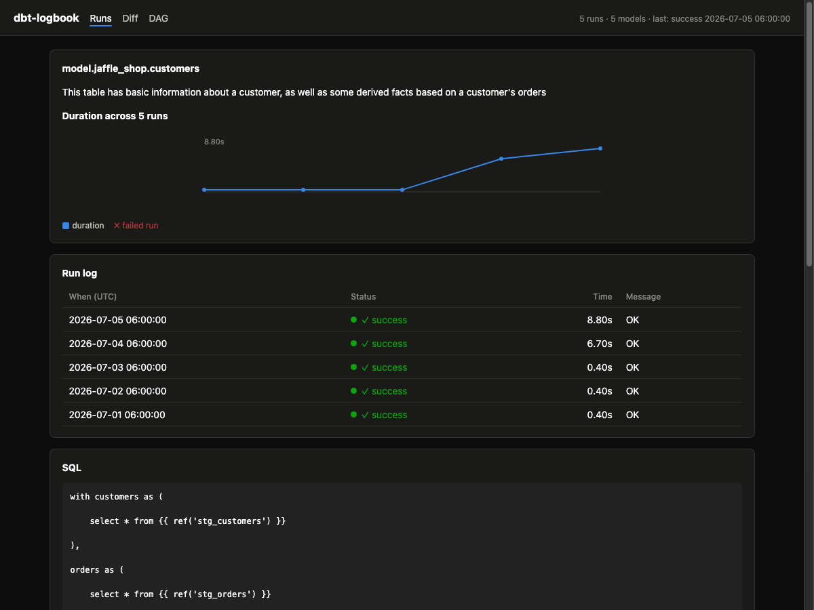

# dbt-logbook

Run history for dbt. Every invocation recorded, nothing overwritten.

dbt writes `run_results.json` and overwrites it on the next run. dbt-logbook keeps
every run in a local SQLite store and gives you the views that history makes
possible - with zero configuration and zero changes to your dbt project.



## What you get

- **Run timeline**: every recorded invocation, status at a glance, failures inline
- **Per-model history**: duration sparkline across runs - see the regression the
  moment it starts, and the failed runs marked on the line
- **What changed between two runs**: checksum-based diff (added / removed /
  modified models), powered by dbt's own per-node checksums
- **Lineage**: clickable DAG from your manifest, tests hidden by default

## Quickstart

```
uvx dbt-logbook demo          # populated playground, no dbt project needed
```

In a real dbt project (any adapter - DuckDB, Snowflake, SQL Server, Postgres, ...):

```
cd your-dbt-project
uvx dbt-logbook ui            # instant read-only UI over the artifacts dbt already wrote
```

History accrues from the capture wrapper - change one line in your cron/CI:

```
dbt-logbook exec -- dbt build     # runs dbt untouched, records the run
                                  # exit code passes through exactly
```

Or ingest artifacts from anywhere (for example, downloaded CI artifacts):

```
dbt-logbook import path/to/artifacts --env prod
```

## How it works

dbt-logbook reads only dbt's stable surfaces - the CLI and the artifact files
(`manifest.json`, `run_results.json`) - and never imports dbt internals. That is
why it works unchanged across dbt Core 1.7 through 2.0 (tested against golden
artifacts of 1.7, 1.8, 1.10, 1.11, and 2.0-alpha), and why it needs no dbt
installation of its own.

Every run's artifacts land in `.dbtlogbook/history.db` (SQLite; add
`.dbtlogbook/` to your project's `.gitignore`). Manifests are content-hashed and
gzipped, so the store stays small. Failed dbt runs are captured too - those are
the ones you'll want history for.

## Platform notes

- macOS and Linux. On Windows, `ui` and `import` are untested but should work
  (pure Python); `exec` is unsupported for now (POSIX signal semantics).
- The UI binds to localhost only.

## Roadmap

- v0.2: local metadata API + MCP server over the store - ask your agent
  "what broke last night and what changed?"
- v0.3: scheduler + Slack/Teams alerts (`dbt-logbook serve`)
- v0.4: state-based CI state serving (last-good manifest per environment)

License: Apache-2.0. Not affiliated with dbt Labs; "dbt" is a trademark of
dbt Labs, Inc.
