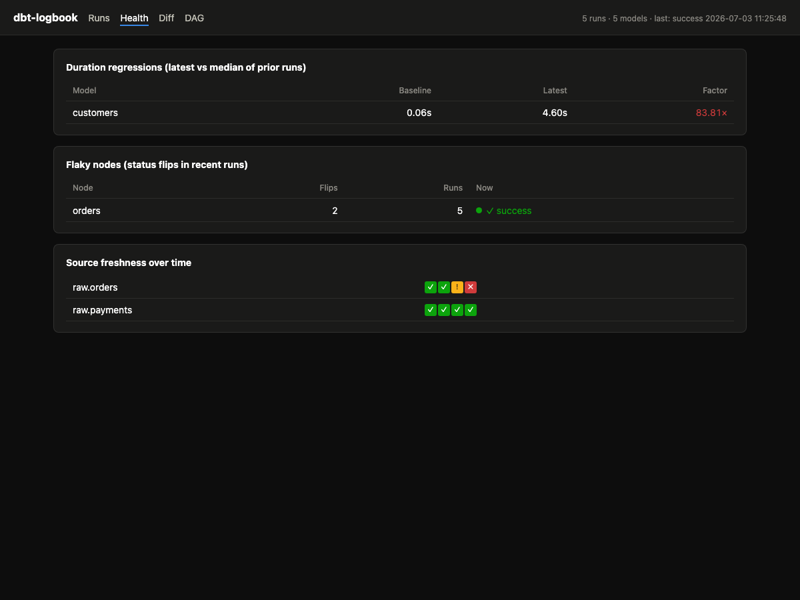

# dbt-logbook

The self-hosted operations layer for production dbt Core. Keep dbt Core, add
the missing operational layer, stay self-hosted.

At its core: run history. dbt writes `run_results.json` and overwrites it on
the next run; dbt-logbook keeps every run in a local SQLite store and gives you
the views that history makes possible - run timelines, regressions, diffs,
scheduling, CI state, an agent-facing metadata API - with zero configuration
and zero changes to your dbt project.


## What you get

**In your terminal and browser** - `ui` / `serve`:
- run timeline with failures inline; per-model duration sparklines that show a
  regression the day it starts; checksum-based what-changed diffs between any
  two runs; clickable lineage; source freshness over time
- a cron scheduler with retries and Slack/Teams alerts on failure and recovery
- top-spenders view: compute cost per model with zero warehouse credentials
  (exact bytes on BigQuery, duration x your rate everywhere else)

**On your pull requests** - `ci-report`:
- changed models vs the last-good state, downstream blast radius, failed
  tests, and anything running slower than its own history (with cost deltas) -
  posted as a PR comment, served from the same store your team already runs

**In your agent** - `mcp`:
- "what broke last night?", "which models got slower this week?", "which
  tests are flaky?", "what would state:modified rebuild?" - history-backed
  answers that current-state tools structurally cannot give

## Quickstart

```
uvx dbt-logbook demo          # populated playground, no dbt project needed
```

In a real dbt project (any adapter - DuckDB, Snowflake, SQL Server, Postgres, ...):

```
cd your-dbt-project
uvx dbt-logbook ui            # instant read-only UI over the artifacts dbt already wrote
```

History accrues from the capture wrapper - change one line in your cron/CI:

```
dbt-logbook exec -- dbt build     # runs dbt untouched, records the run
                                  # exit code passes through exactly
```

Or ingest artifacts from anywhere (for example, downloaded CI artifacts):

```
dbt-logbook import path/to/artifacts --env prod
```

## Ask your agent about your runs (MCP)

The history store is exposed as an MCP server - the cross-run questions that
current-state tools structurally can't answer, because dbt overwrites its
artifacts:

```
claude mcp add dbt-logbook -- uvx dbt-logbook mcp     # from your dbt project dir
```

Then ask: *"what broke last night?"*, *"which models got slower this week?"*,
*"which tests are flaky?"*, *"what changed between the last two runs?"*,
*"what would state:modified rebuild?"*. Full tool list and REST equivalents:
[docs/api-contract.md](docs/api-contract.md).

## Run it as the platform (scheduler + alerts)

One process replaces cron + hope. Drop a `dbt-logbook.yml` in the project root:

```yaml
schedules:
  hourly:
    cron: "0 * * * *"
    command: dbt build
    retries: 2
notify:
  slack_webhook: https://hooks.slack.com/services/...   # or teams_webhook
  on: [failure, recovery]
```

```
dbt-logbook serve
```

You get: cron scheduling with retries, every run recorded, a Slack/Teams ping
on new failures and on recovery, auto-import of runs that happen outside the
scheduler (a `target/` watcher), and the UI - all one process, localhost only.

Keep it alive the boring way: `docker run --restart unless-stopped ...` or a
systemd unit with `Restart=on-failure`.

## State-based CI without artifact plumbing

The store already holds every environment's last-good manifest - serve it to CI
instead of copying `manifest.json` to S3:

```yaml
# in CI, against a reachable dbt-logbook serve --host ... --token ...
- run: |
    curl -sf -H "Authorization: Bearer $DBT_LOGBOOK_TOKEN" \
      "$LOGBOOK_URL/api/state/prod/manifest.json" -o ci-state/manifest.json
    dbt build --select state:modified --defer --state ci-state
```

Locally the same thing is one command: `dbt-logbook state --env prod --out ci-state`.
Binding beyond localhost requires a token; `/api/*` then demands
`Authorization: Bearer <token>`.

### The PR comment

After the build, `ci-report` turns the run into a reviewable verdict - changed
models, downstream blast radius, failures, and anything slower than its own
history (with cost deltas when a rate is configured):

```yaml
- name: dbt build against last-good state
  run: |
    curl -sf -H "Authorization: Bearer $DBT_LOGBOOK_TOKEN" \
      "$LOGBOOK_URL/api/state/prod/manifest.json" -o ci-state/manifest.json
    dbt build --select state:modified+ --defer --state ci-state
- name: PR report
  if: always()
  env:
    GH_TOKEN: ${{ github.token }}
  run: |
    uvx dbt-logbook ci-report --state-env prod \
      --server "$LOGBOOK_URL" --token "$DBT_LOGBOOK_TOKEN" > report.md
    gh pr comment ${{ github.event.pull_request.number }} \
      --edit-last --create-if-none --body-file report.md
```

## Spend visibility, no credentials

Add a rate to `dbt-logbook.yml` and the Health screen + `get_cost_summary`
MCP tool show estimated compute cost per model (duration x rate - honest
estimates, labeled as such). Where the adapter reports exact volume
(BigQuery's bytes billed), you get real numbers with zero warehouse
credentials - it's already in the artifacts dbt writes.

```yaml
cost:
  rate_per_hour: 3.50   # your warehouse's effective $/hour
```

## How it works

dbt-logbook reads only dbt's stable surfaces - the CLI and the artifact files
(`manifest.json`, `run_results.json`) - and never imports dbt internals. That is
why it works unchanged across dbt Core 1.7 through 2.0 (tested against golden
artifacts of every supported version - see [docs/compatibility.md](docs/compatibility.md)),
and why it needs no dbt installation of its own.

Every run's artifacts land in `.dbtlogbook/history.db` (SQLite; add
`.dbtlogbook/` to your project's `.gitignore`). Manifests are content-hashed and
gzipped, so the store stays small. Failed dbt runs are captured too - those are
the ones you'll want history for.

## Platform notes

- macOS and Linux. On Windows, `ui` and `import` are untested but should work
  (pure Python); `exec` is unsupported for now (POSIX signal semantics).
- The UI binds to localhost only.

## Health screen

`#/health` in the UI: duration regressions (latest vs median baseline), flaky
nodes (status flips across recent runs), and source freshness over time (from
`dbt source freshness` snapshots the watcher or wrapper picks up). Generated
`dbt docs` output is served at `/docs-site/` when present.



## Roadmap

What ships next is decided by real usage, not by us guessing. Deferred and
demand-gated items - team/server mode, warehouse cost integrations, Windows
`exec`, GitLab CI, the UI rebuild - live in [TODOS.md](TODOS.md) with the
trigger that unblocks each. If one of them is blocking you, open an issue.

License: Apache-2.0. Not affiliated with dbt Labs; "dbt" is a trademark of
dbt Labs, Inc.
